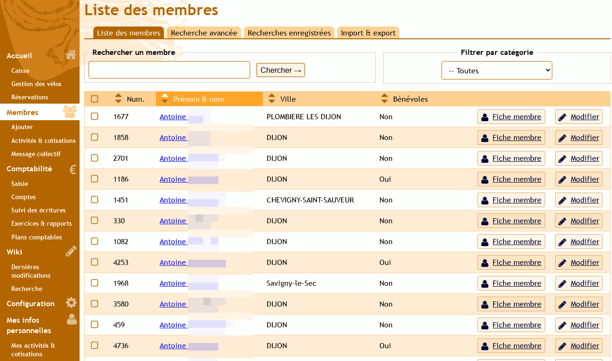

<!--
N.B.: This README was automatically generated by https://github.com/YunoHost/apps/tree/master/tools/README-generator
It shall NOT be edited by hand.
-->

# Garradin for YunoHost

[](https://dash.yunohost.org/appci/app/garradin)    
[](https://install-app.yunohost.org/?app=garradin)

*[Lire ce readme en français.](./README_fr.md)*

> *This package allows you to install Garradin quickly and simply on a YunoHost server.
If you don't have YunoHost, please consult [the guide](https://yunohost.org/#/install) to learn how to install it.*

## Overview

Garradin (word meaning money in an aboriginal dialect of northern Australia, pronounced "gar-a-dine" em) is software for associative management. It is the tool of choice for managing an association, a sports club, an NGO, etc. It is designed to meet the needs of a small to medium-sized structure: management of members, accounting, website, note-taking in meetings, archiving and sharing of the association's operating documents, discussion between members, etc. etc. . 

## Garradin becomes Paheko! 
### Why change your name?

It appeared that the pronunciation of "Garradin" in French is sometimes a bit complicated, as is its spelling. 

There is already a commercial software called "Garradin" in Australia, which does finance for large groups. For the moment this was not a problem because our association management solution was only available in French and until then did not have much scope. But we would like to be able to offer the software in other languages in the years to come, and as Garradin (the French project) is starting to be quite well known, it seems necessary to limit the risk of confusion in the future with this commercial solution. 

### What will be the new name? 

We chose the name Paheko, a word from the Māori language meaning "to cooperate", illustrating the purpose of the software: to improve together the daily management of an association:)


**Shipped version:** 1.2.4~ynh1

**Demo:** https://paheko.cloud/essai/

## Screenshots



## Documentation and resources

* Official app website: <https://paheko.cloud>
* Official admin documentation: <https://fossil.kd2.org/paheko/wiki?name=Documentation>
* Upstream app code repository: <https://fossil.kd2.org/paheko/dir?ci=tip>
* YunoHost documentation for this app: <https://yunohost.org/app_garradin>
* Report a bug: <https://github.com/YunoHost-Apps/garradin_ynh/issues>

## Developer info

Please send your pull request to the [testing branch](https://github.com/YunoHost-Apps/garradin_ynh/tree/testing).

To try the testing branch, please proceed like that.

``` bash
sudo yunohost app install https://github.com/YunoHost-Apps/garradin_ynh/tree/testing --debug
or
sudo yunohost app upgrade garradin -u https://github.com/YunoHost-Apps/garradin_ynh/tree/testing --debug
```

**More info regarding app packaging:** <https://yunohost.org/packaging_apps>
