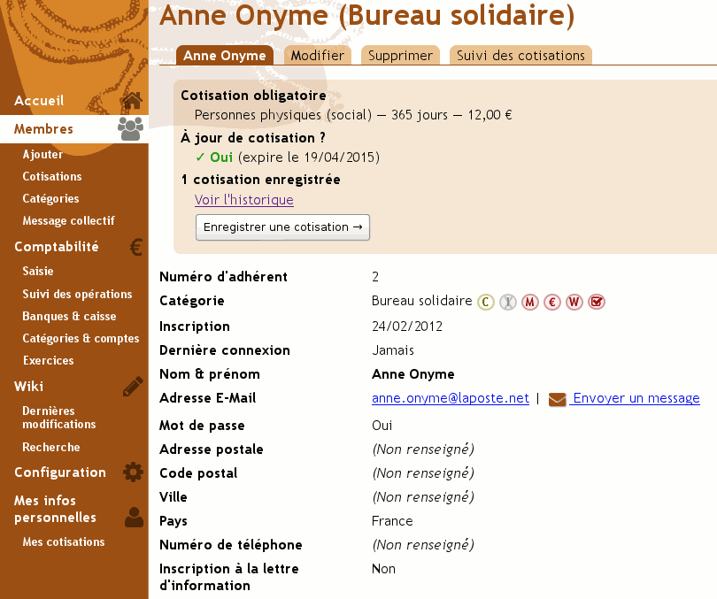
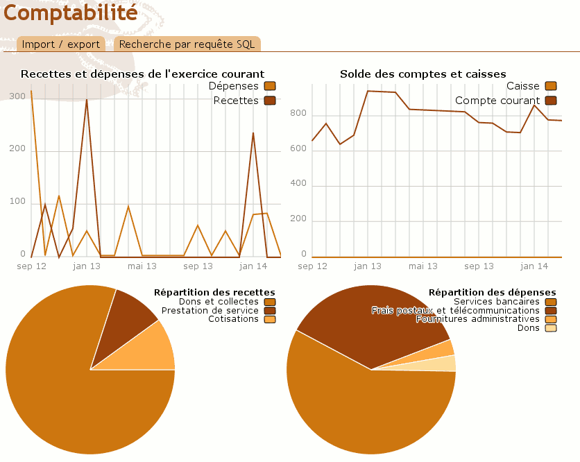
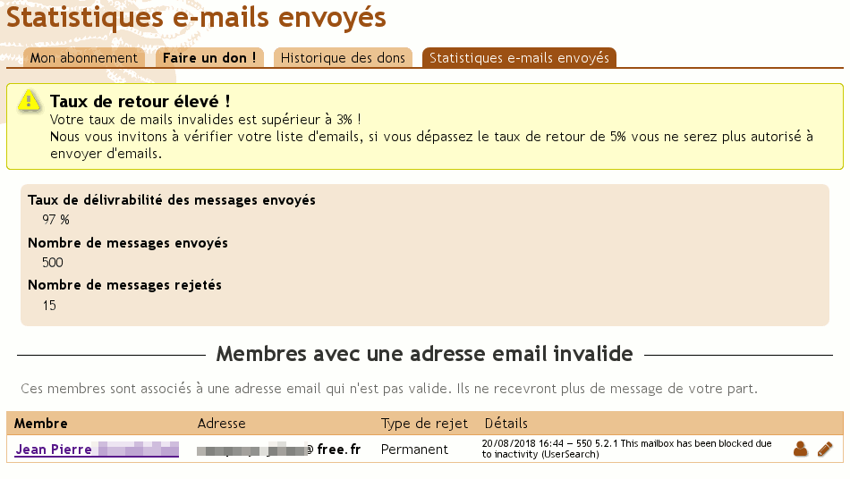
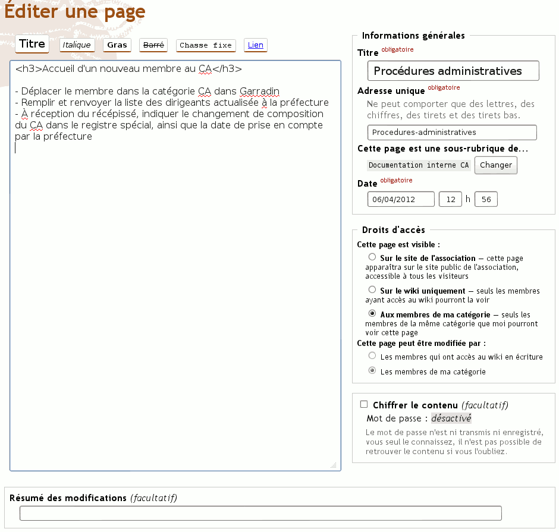
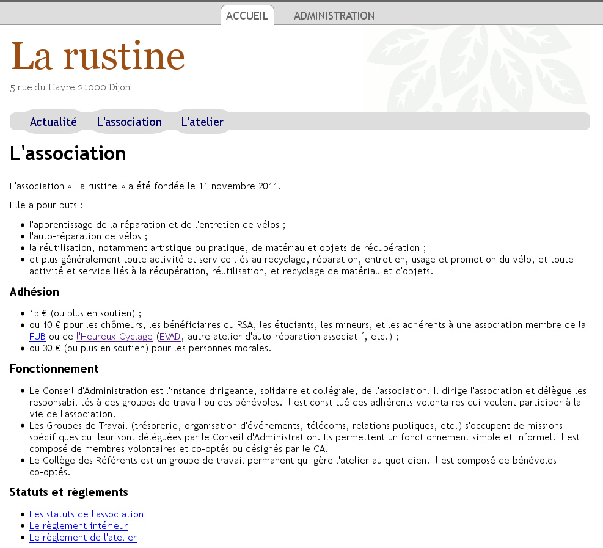

# Garradin pour YunoHost

[](https://dash.yunohost.org/appci/app/garradin)  
[](https://install-app.yunohost.org/?app=garradin)

*[Read this readme in english.](./README.md)*

> *Ce package vous permet d'installer Garradin rapidement et simplement sur un serveur YunoHost.
Si vous n'avez pas YunoHost, consultez [le guide](https://yunohost.org/#/install) pour apprendre comment l'installer.*

## Vue d'ensemble
Garradin est un logiciel libre de gestion associative. il permet de gérer des membres.

**Version incluse :** 1.0.4

## Captures d'écran







## Démo

* [Démo officielle](https://garradin.eu/essai/)

## Documentation

 * Documentation officielle : https://fossil.kd2.org/garradin/wiki?name=Documentation

## Caractéristiques spécifiques YunoHost

#### Support multi-utilisateur

* L'authentification LDAP n'est pas disponible.

#### Architectures supportées

* x86-64 - [](https://ci-apps.yunohost.org/ci/apps/garradin/)
* ARMv8-A - [](https://ci-apps-arm.yunohost.org/ci/apps/garradin/)

## Limitations

* Garradin n'est disponible qu'en français.
* N'installez pas cette apllication à la racine du domaine par défaut sans ajouter un sous-domaine. Sinon la page de connexion SSO sera remplacée par la page d'accueil de Garradin.

## Liens

 * Signaler un bug : https://github.com/YunoHost-Apps/garradin_ynh/issues
 * Site de l'application : http://garradin.eu
 * Dépôt de l'application principale : https://fossil.kd2.org/garradin/wiki?name=Garradin
 * Site web YunoHost : https://yunohost.org/

---

## Informations pour les développeurs

Merci de faire vos pull request sur la [branche testing](https://github.com/YunoHost-Apps/garradin_ynh/tree/testing).

Pour essayer la branche testing, procédez comme suit.
```
sudo yunohost app install https://github.com/YunoHost-Apps/garradin_ynh/tree/testing --debug
ou
sudo yunohost app upgrade garradin -u https://github.com/YunoHost-Apps/garradin_ynh/tree/testing --debug
```
